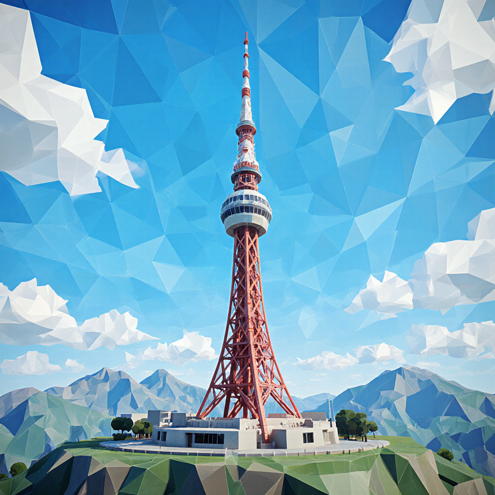
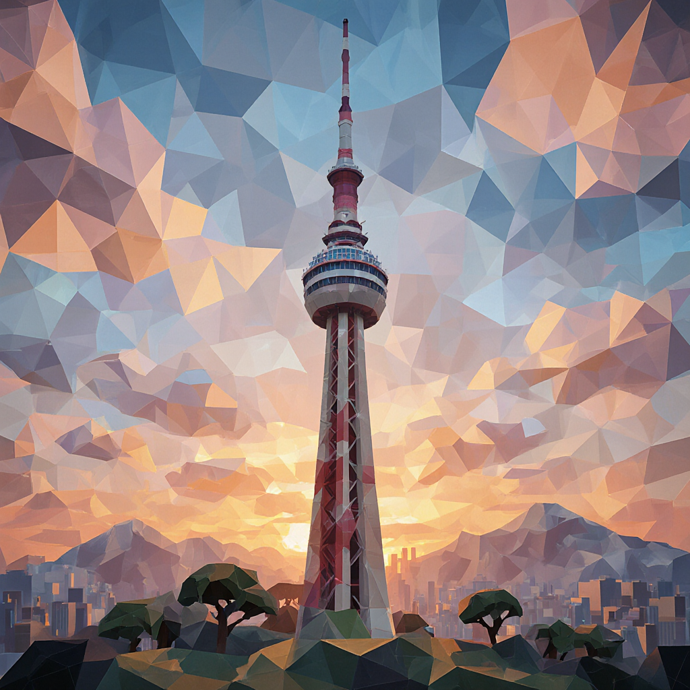

# FLUX Krea Global City Image Generator

**ComfyUI용 전 세계 도시 랜드마크 이미지 생성기**

Low Poly 스타일의 날씨별 도시 랜드마크 이미지를 자동 생성하는 배치 시스템입니다. Flutter 앱 개발 등에서 사용할 수 있는 고품질 UI 이미지를 제공합니다.

## 🌟 주요 특징

- **47개 주요 도시**의 대표 랜드마크 이미지 생성
- **15개 관광지/휴양지 도시** 추가 (몰디브, 발리, 삿포로, 두브로브니크 등)
- **8개 지역 폴백**으로 추가적인 지역 커버리지 제공
- **6가지 날씨 조건** (맑음, 흐림, 비, 눈, 일몰, 안개)
- **FLUX Krea + NOC Low Poly LoRA** 스타일 적용
- **시간대별 폴더 구조**로 자동 정리
- **기존 이미지 자동 덮어쓰기** 기능
- **영어 인터페이스**로 안정적 실행

## 📁 파일 구조

```
ComfyUI_Batch/
├── easy_batch_generator.bat        # 메인 실행 파일
├── global_cities_config.json       # 47개 주요 도시 설정 파일
├── resort_cities_config.json       # 15개 관광지 도시 설정 파일
├── regional_batch_generator.py     # 지역별/관광지 생성 스크립트
├── regional_fallback_config.json   # 8개 지역 폴백 설정 파일
├── regional_fallback_generator.py  # 지역 폴백 생성 스크립트
├── regional_batch_generator_korean.py  # 한국어 인터페이스 버전
├── create_single_config.py         # 개별 도시 설정 생성
└── deleted/                        # 삭제된 파일들 백업
```

## 🚀 사용법

### 1. 기본 실행
```cmd
.\easy_batch_generator.bat
```

### 2. 메뉴 옵션
- **[1-5]** 지역별 생성 (아시아-태평양, 유럽, 북미, 중동/아프리카, 남미)
- **[6]** 관광지/휴양지 생성 (15개 도시, 90개 이미지, 3-4시간)
- **[7]** 지역 폴백 생성 (8개 지역, 48개 이미지, 2-3시간)
- **[8]** 전체 지역 생성 (47개 도시, 282개 이미지, 9-14시간)
- **[9]** 개별 도시 선택
- **[10]** 테스트 실행 (처음 2개 도시)
- **[11]** 특정 날씨만 생성
- **[12]** 지역 정보 표시
- **[13]** 기존 이미지 삭제

## 🌍 지원 도시 (47개)

### 아시아-태평양 (12개 도시)
- Seoul (N Seoul Tower), Tokyo (Sensoji), Beijing (Forbidden City)
- Singapore (Marina Bay Sands), Bangkok (Wat Arun), Mumbai (Gateway of India)
- Bangalore (Vidhana Soudha), Jakarta (Monas), Kuala Lumpur (Petronas Twin Towers)
- Manila (Rizal Park), Ho Chi Minh City (Independence Palace), Sydney (Opera House)

### 유럽 (12개 도시)
- London (Big Ben), Paris (Eiffel Tower), Berlin (Brandenburg Gate)
- Amsterdam (Canals), Zurich (Grossmünster), Stockholm (City Hall)
- Barcelona (Sagrada Familia), Rome (Colosseum), Istanbul (Hagia Sophia)
- Moscow (Kremlin), Prague (Castle), Vienna (Schönbrunn Palace)

### 북미 (10개 도시)
- New York (Central Park), Los Angeles (Hollywood Sign), Chicago (Willis Tower)
- Toronto (CN Tower), Boston (Common), Miami (Art Deco District)
- San Francisco (Golden Gate Bridge), Washington DC (US Capitol)
- Seattle (Space Needle), Vancouver (Granville Island)

### 중동 & 아프리카 (8개 도시)
- Dubai (Burj Khalifa), Riyadh (Diriyah), Tehran (Azadi Tower)
- Cairo (Pyramids), Johannesburg (Carlton Centre), Nairobi (KICC)
- Casablanca (Hassan II Mosque), Tel Aviv (Beach)

### 남미 (5개 도시)
- São Paulo (Paulista Avenue), Rio de Janeiro (Christ the Redeemer)
- Buenos Aires (Obelisk), Santiago (Santa Lucia Hill)
- Mexico City (Metropolitan Cathedral)

## 🏖️ 관광지/휴양지 도시 (15개)

### 열대 리조트 (5개 도시)
- **몰디브** (Malé) - Overwater Bungalows
- **푸켓** (Thailand) - Patong Beach  
- **발리** (Indonesia) - Uluwatu Temple
- **칸쿤** (Mexico) - Chichen Itza Pyramid
- **하와이** (USA) - Diamond Head Crater

### 산악 리조트 (4개 도시)
- **아스펜** (USA) - Maroon Bells
- **체르마트** (Switzerland) - Matterhorn Peak
- **타히티** (French Polynesia) - Bora Bora Lagoon
- **퀸스타운** (New Zealand) - Remarkables Mountains

### 문화 유산지 (6개 도시)
- **삿포로** (Japan) - Susukino Hot Springs
- **두브로브니크** (Croatia) - Old City Walls
- **페트라** (Jordan) - Treasury
- **산토리니** (Greece) - Oia Village
- **마추픽추** (Peru) - Machu Picchu Ruins
- **앙코르와트** (Cambodia) - Angkor Wat Temple

> **관광지 특화**: 세계 최고의 휴양지, 스키 리조트, 문화 유산 등 특별한 관광 목적지들로 구성

## 🌐 지역 폴백 (8개 지역)

추가적인 지역 커버리지를 위한 대표 랜드마크 이미지:

### 추가 커버리지 지역
- **Northern India** - Taj Mahal (UTC+5:30)
- **China Inland** - Great Wall of China (UTC+8) 
- **Southeast Asia Extended** - Angkor Wat (UTC+7)
- **West Africa** - Mosque of Djenné (UTC+0)
- **Eastern Europe** - St. Basil's Cathedral (UTC+3)
- **Northern Andes** - Machu Picchu (UTC-5)
- **Central Asia** - Registan Square (UTC+5)
- **Oceania Extended** - Ayers Rock (UTC+9:30)

> **폴백 시스템**: 메인 47개 도시로 커버되지 않는 지역을 대표하는 랜드마크들로, 각 지역의 문화적 특징을 반영합니다.

## 🌤️ 날씨 조건

1. **Sunny** - 맑은 하늘, 밝은 햇빛
2. **Cloudy** - 흐린 하늘, 부드러운 조명
3. **Rainy** - 비 오는 날, 극미세 기하학적 빗방울
4. **Snowy** - 눈 오는 날, 극미세 기하학적 눈송이
5. **Sunset** - 일몰, 따뜻한 오렌지-핑크 색상
6. **Foggy** - 안개, 신비로운 분위기

## 🎨 생성 스타일

- **Low Poly Art Style**: 각진 기하학적 형태
- **FLUX Krea Model**: 고품질 AI 이미지 생성
- **NOC Low Poly LoRA**: 초각진 기하학적 스타일
- **구름 투명화**: remove.bg 사이트를 이용하여 구름 배경 제거 처리

## 🖼️ 샘플 이미지

### 서울 - N Seoul Tower

<div align="center">
  <table>
    <tr>
      <td align="center">
        
        <br/><em>Seoul N Seoul Tower - Sunny Weather</em>
      </td>
      <td align="center">
        
        <br/><em>Seoul N Seoul Tower - Sunset Weather</em>
      </td>
    </tr>
  </table>
</div>

> **샘플 특징**: 각진 기하학적 저폴리 스타일로 렌더링된 서울타워. 날씨별로 색상과 분위기가 다르게 표현됨.
- **1024x1024 해상도**: 고해상도 출력
- **시간대별 폴더**: UTC 기준 자동 분류

## 📂 출력 구조

```
ComfyUI/output/timezones/
├── utc_plus_9/          # 서울, 도쿄
├── utc_plus_8/          # 싱가포르, 쿠알라룸푸르, 마닐라
├── utc_plus_7/          # 방콕, 자카르타, 호치민
├── utc_plus_5_30/       # 뭄바이, 방갈로르
├── utc_plus_10/         # 시드니
├── utc_plus_1/          # 대부분의 유럽 도시들
├── utc_plus_0/          # 런던, 카사블랑카
├── utc_plus_3/          # 이스탄불, 모스크바, 리야드, 나이로비
├── utc_plus_3_30/       # 테헤란
├── utc_plus_4/          # 두바이
├── utc_plus_2/          # 카이로, 요하네스버그, 텔아비브
├── utc_minus_5/         # 뉴욕, 토론토, 보스턴, 마이애미, 워싱턴DC
├── utc_minus_8/         # 로스앤젤레스, 샌프란시스코, 시애틀, 밴쿠버
├── utc_minus_6/         # 시카고, 멕시코시티
├── utc_minus_3/         # 상파울루, 리우데자네이루, 부에노스아이레스, 산티아고
└── ...
```

## ⚙️ 시스템 요구사항

- **ComfyUI** 설치 및 실행 중
- **FLUX Krea 모델** 설치 (`flux1-krea-dev_fp8_scaled.safetensors`)
- **NOC Low Poly LoRA** 설치 (`noc-lwply.safetensors`)
- **Python 3.x** 설치
- **VRAM 12GB 이상** 권장 (GPU)
- **Windows 10/11** (배치 파일 실행용)

## 🔧 모델 파일

### 필수 모델 파일들:
- `flux1-krea-dev_fp8_scaled.safetensors` (UNET)
- `clip_l.safetensors` (CLIP Vision)
- `t5xxl_fp16.safetensors` (CLIP Text)
- `ae.safetensors` (VAE)
- `noc-lwply.safetensors` (LoRA)

### LoRA 활성화 키워드:
- `lo-ply_`, `noc-lwply,`

## 📊 생성 시간 예상

| 지역 | 도시/지역 수 | 이미지 수 | 예상 시간 |
|------|-------------|-----------|-----------|
| 아시아-태평양 | 12 | 72 | 2-3시간 |
| 유럽 | 12 | 72 | 2-3시간 |
| 북미 | 10 | 60 | 2-3시간 |
| 중동/아프리카 | 8 | 48 | 1-2시간 |
| 남미 | 5 | 30 | 1-2시간 |
| **관광지/휴양지** | **15** | **90** | **3-4시간** |
| **지역 폴백** | **8** | **48** | **2-3시간** |
| **전체 (주요 도시)** | **47** | **282** | **9-14시간** |
| **전체 (관광지 포함)** | **62** | **372** | **12-18시간** |
| **전체 (폴백 포함)** | **70** | **420** | **14-21시간** |

## 💡 사용 팁

1. **테스트 실행 먼저**: [9] Test Run으로 시스템 확인
2. **개별 도시 생성**: [9] Individual City로 원하는 도시만 선택  
3. **관광지 우선 생성**: [6] Resort Destinations로 인기 휴양지 먼저 생성
4. **지역 폴백 활용**: [7] Regional Fallbacks로 추가 지역 커버리지 확보
5. **특정 날씨만**: [11] Weather Selection으로 필요한 날씨만 생성
6. **기존 이미지 관리**: [13] Clear Images로 기존 파일 정리
7. **시간대 활용**: Flutter 앱에서 현재 시간대에 맞는 이미지 로드

## 🎯 Flutter 앱 연동 예시

```dart
// 현재 시간대에 따른 이미지 로드
String getTimezoneFolder() {
  final now = DateTime.now();
  final offset = now.timeZoneOffset.inHours;
  
  if (offset >= 0) {
    return 'utc_plus_$offset';
  } else {
    return 'utc_minus_${offset.abs()}';
  }
}

// 날씨별 이미지 로드
String getCityImage(String city, String weather) {
  final timezone = getTimezoneFolder();
  return 'assets/timezones/$timezone/${city}_${weather}_lowpoly.png';
}
```

## 🔄 업데이트 히스토리

- **v1.5** - 🏖️ **관광지/휴양지 시스템 추가** (15개 도시), 지역별 다양성 강화 (삿포로, 두브로브니크, 타히티 등)
- **v1.4** - 지역 폴백 시스템 추가 (8개 추가 지역), 영어 인터페이스 전환, NOC Low Poly LoRA 적용
- **v1.3** - Melbourne, Hong Kong, Shanghai 제거 (47개 도시)
- **v1.2** - 랜드마크 업데이트 (Metropolitan Cathedral, Santa Lucia Hill, Central Park 등)
- **v1.1** - 불필요한 파일 정리, 폴더 구조 최적화
- **v1.0** - 초기 버전, 50개 도시 지원

### v1.5 주요 변경사항
- **15개 관광지 추가**: 몰디브, 발리, 푸켓, 하와이, 칸쿤, 아스펜, 체르마트, 타히티, 퀸스타운, 삿포로, 두브로브니크, 페트라, 산토리니, 마추픽추, 앙코르와트
- **지역적 다양성 개선**: 동일 국가 내 가까운 도시들을 원거리 관광지로 교체
- **새로운 국가 추가**: 몰디브, 크로아티아, 프렌치 폴리네시아 등 8개 새로운 국가
- **배치 메뉴 개선**: [6] Resort Destinations 옵션 추가, 개별 관광지 선택 지원
- **총 도시 수**: 47개 주요 도시 + 15개 관광지 = **62개 도시**

## 📝 라이선스

이 프로젝트는 개인 및 상업적 용도로 자유롭게 사용 가능합니다.

## 🤝 기여

버그 리포트나 기능 제안은 언제든 환영합니다!

---

**Generated by FLUX Krea + NOC Low Poly LoRA**  
*Perfect for Flutter app development and UI design*
